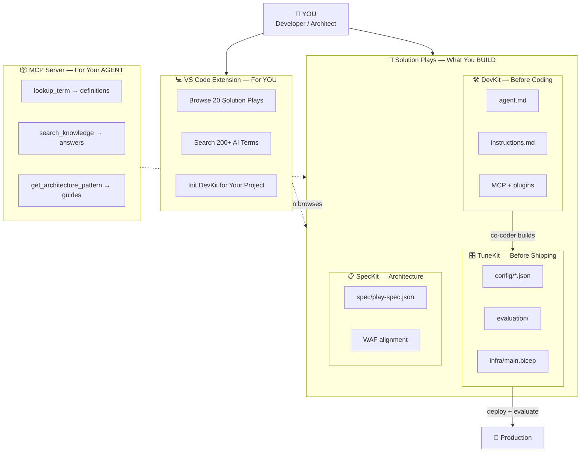
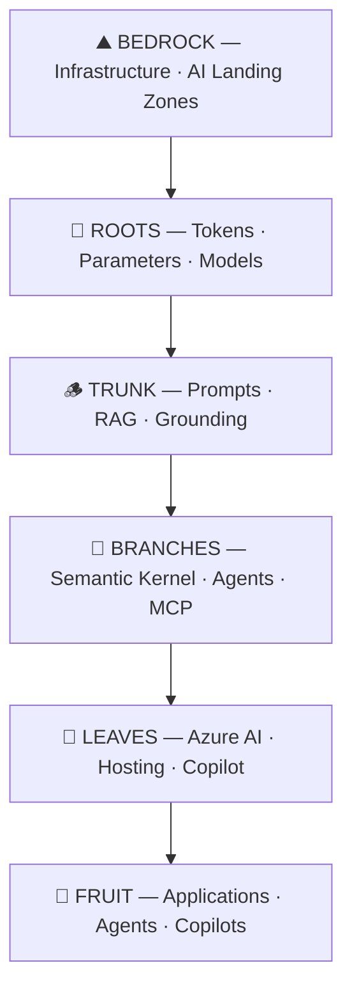

# 🌳 FrootAI™ — From the Roots to the Fruits.

> The open glue binding Infrastructure, Platform & Application teams with the GenAI ecosystem.
> A power kit for infrastructure, platform, and application teams to master and bridge the gap between AI Infra, AI Platform, and the AI Application/Agentic Ecosystem.

[](https://marketplace.visualstudio.com/items?itemName=pavleenbali.frootai)
[](https://www.npmjs.com/package/frootai-mcp)
[](https://github.com/gitpavleenbali/frootai)
[](https://github.com/gitpavleenbali/frootai/actions/workflows/deploy.yml)
[](https://github.com/gitpavleenbali/frootai/actions/workflows/docker-publish.yml)
[](https://www.npmjs.com/package/frootai-mcp)
[](https://github.com/gitpavleenbali/frootai/actions/workflows/uptime.yml)
[](./LICENSE)

---

## What is FrootAI?

**FrootAI** = AI **F**oundations · **R**easoning · **O**rchestration · **O**perations · **T**ransformation

| | What | For Whom |
|---|------|----------|
| 🎯 | **Solution Plays** — pre-tuned, deployable AI solutions (RAG, agents, landing zones) | Infra & platform engineers |
| 📖 | **16 knowledge modules** covering AI architecture end-to-end | Cloud Architects, CSAs |
| 🔌 | **MCP Server** — 22 tools (6 static + 4 live + 3 agent chain + 3 AI ecosystem + 6 compute), add to any AI agent as a callable skill set | Agent builders, developers |
| 🔗 | **The open glue** — removes silos between infra, platform, and app teams | Everyone |

---

## Quick Start

### Scaffold a new project (CLI)

```bash
npx frootai init
```

3 questions → scaffolds .vscode/mcp.json + agents + configs in one command.

### Read the docs

```
https://frootai.dev
```

### Install the MCP Server

```bash
# npm (recommended)
npx frootai-mcp@latest

# Or install globally
npm install -g frootai-mcp@latest

# Docker (no Node.js needed)
docker run -i ghcr.io/gitpavleenbali/frootai-mcp
```

### CLI Commands

```bash
npx frootai init                          # Interactive project scaffolding
npx frootai search "RAG architecture"     # Search knowledge base
npx frootai cost enterprise-rag --scale prod  # Cost estimate
npx frootai validate                      # Check project structure
npx frootai doctor                        # Health check
```

**npm**: [npmjs.com/package/frootai-mcp](https://www.npmjs.com/package/frootai-mcp) · **Docker**: [ghcr.io/gitpavleenbali/frootai-mcp](https://github.com/gitpavleenbali/frootai/pkgs/container/frootai-mcp)

Then add to your MCP config:

```json
{
  "mcpServers": {
    "frootai": { "command": "npx", "args": ["frootai-mcp@latest"] }
  }
}
```

Works with: **Claude Desktop** · **VS Code / GitHub Copilot** · **Cursor** · **Windsurf** · **Azure AI Foundry** · any MCP client

### Install the VS Code Extension

```bash
# From VS Code Marketplace
code --install-extension pavleenbali.frootai
```

Or search **"FrootAI"** in VS Code Extensions (Ctrl+Shift+X).

**Marketplace**: [marketplace.visualstudio.com → pavleenbali.frootai](https://marketplace.visualstudio.com/items?itemName=pavleenbali.frootai)

**What you get:**
- Sidebar with Solution Plays, FROOT Modules, MCP Tools
- Commands: Look Up Term, Search Knowledge, Init DevKit, Architecture Patterns
- Status bar integration

---

## How the Ecosystem Works



| Component | Who Uses It | What It Does |
|-----------|------------|-------------|
| **VS Code Extension** | You (human) | Browse plays, search terms, init DevKit/TuneKit/SpecKit, auto-chain agents |
| **MCP Server (npm)** | Your AI agent | Copilot/Claude calls 22 tools (6 static + 4 live + 3 chain + 3 AI ecosystem + 6 compute) |
| **CLI** | You (terminal) | `npx frootai init/search/cost/validate/doctor` — scaffolding, search, cost estimates |
| **DevKit (.github/ + infra/)** | Developer | .github Agentic OS + Bicep infrastructure + co-coder context |
| **TuneKit (config/ + eval/)** | Platform team | AI parameter tuning: temperature, models, guardrails, evaluation |
| **SpecKit (spec/ + WAF)** | Architect | Architecture specification, WAF alignment, evaluation thresholds |
| **REST API** | Any client | 5 endpoints: chat, search, cost, health, OpenAPI — [/api-docs](https://frootai.dev/api-docs) |

### .github Agentic OS (per Solution Play)

Every solution play ships with the full GitHub Copilot agentic OS — 4 layers, 7 primitives, 19 files:

```
.github/
├── copilot-instructions.md          # Layer 1: Always-On Context
├── instructions/                     # Layer 1: Modular standards
│   ├── azure-coding.instructions.md
│   ├── <play>-patterns.instructions.md
│   └── security.instructions.md
├── prompts/                          # Layer 2: Slash commands
│   ├── deploy.prompt.md   (/deploy)
│   ├── test.prompt.md     (/test)
│   ├── review.prompt.md   (/review)
│   └── evaluate.prompt.md (/evaluate)
├── agents/                           # Layer 2: Chained agents
│   ├── builder.agent.md   (builds)
│   ├── reviewer.agent.md  (reviews)
│   └── tuner.agent.md     (tunes)
├── skills/                           # Layer 2: Self-contained logic
│   ├── deploy-azure/SKILL.md + deploy.sh
│   ├── evaluate/SKILL.md
│   └── tune/SKILL.md + tune-config.sh
├── hooks/                            # Layer 3: Enforcement
│   └── guardrails.json   (preToolUse policy gates)
└── workflows/                        # Layer 3: AI-driven CI
    ├── ai-review.md
    └── ai-deploy.md
plugin.json                              # Layer 4: Distribution manifest
```

**19 .github files + plugin.json × 20 plays = 400 agentic OS files shipped.**

---

## The FROOT Framework



| Layer | Modules | What You Learn |
|-------|---------|---------------|
| 🌱 **F — Foundations** | F1, F2, F3, F4 | Tokens, transformers, model selection, 200+ AI terms, .github Agentic OS |
| 🪵 **R — Reasoning** | R1, R2, R3 | Prompts, RAG, grounding, deterministic AI |
| 🌿 **O — Orchestration** | O1, O2, O3 | Semantic Kernel, agents, MCP, tools |
| 🍃 **O — Operations** | O4, O5, O6 | Azure AI Foundry, GPU infra, Copilot ecosystem |
| 🍎 **T — Transformation** | T1, T2, T3 | Fine-tuning, responsible AI, production patterns |

---

## MCP Server — 22 tools (v3)

### Static Tools (bundled knowledge)

| Tool | What It Does |
|------|-------------|
| `list_modules` | Browse all 16 modules by FROOT layer |
| `get_module` | Read any module content (F1–T3, F4) |
| `lookup_term` | Look up any of 200+ AI/ML terms |
| `search_knowledge` | Full-text search across all modules |
| `get_architecture_pattern` | 7 pre-built decision guides |
| `get_froot_overview` | Complete FROOT framework summary |

### Live Tools (network-enabled, graceful fallback)

| Tool | What It Does |
|------|-------------|
| `fetch_azure_docs` | Search Microsoft Learn for Azure service docs |
| `fetch_external_mcp` | Find MCP servers from public registries |
| `list_community_plays` | List 20 solution plays from GitHub |
| `get_github_agentic_os` | .github agentic OS guide (7 primitives) |

### Agent Chain Tools (build → review → tune)

| Tool | What It Does |
|------|-------------|
| `agent_build` | Builder agent guidance + suggests reviewer |
| `agent_review` | Reviewer agent (security, cost, compliance) |
| `agent_tune` | Tuner agent (production readiness validation) |

### AI Ecosystem Tools (NEW in v2.2)

| Tool | What It Does |
|------|-------------|
| `get_model_catalog` | Azure AI model catalog with pricing + capabilities |
| `get_azure_pricing` | Monthly cost estimates for AI solution architectures |
| `compare_models` | Side-by-side model comparison for a specific use case |

[📖 Full MCP documentation →](./mcp-server/README.md) · [📖 Setup Guide →](https://frootai.dev/setup-guide)

---

## 🎯 Solution Plays

Pre-tuned, deployable AI solutions — infra + AI config + agent instructions + evaluation.

| # | Solution | What It Deploys | Status |
|---|---------|----------------|--------|
| 01 | [Enterprise RAG Q&A](./solution-plays/01-enterprise-rag/) | AI Search + OpenAI + Container App (pre-tuned) | ✅ Ready |
| 02 | [AI Landing Zone](./solution-plays/02-ai-landing-zone/) | VNet + PE + RBAC + GPU + AI Services | ✅ Ready |
| 03 | [Deterministic Agent](./solution-plays/03-deterministic-agent/) | Reliable agent with temp=0, guardrails, eval | ✅ Ready |
| 04–20 | [17 more plays](./solution-plays/) | Voice AI, IT tickets, multi-agent, fine-tuning, edge AI... | 🛠️ Skeleton |

**Every play ships with:** .github Agentic OS (19 files) + DevKit + TuneKit + SpecKit

[📖 All Solution Plays →](./solution-plays/)

---

## Repository Structure

```
frootai/
├── docs/                  ← 16 knowledge modules (markdown)
│   ├── README.md           FROOT framework overview
│   ├── GenAI-Foundations.md  F1
│   ├── LLM-Landscape.md     F2
│   ├── ...                   (all 16 modules)
│   └── T3-Production-Patterns.md  T3
├── mcp-server/            ← MCP server (npm: frootai-mcp@3.2.0)
│   ├── index.js             22 tools (6 static + 4 live + 3 chain + 3 AI ecosystem + 6 compute)
│   ├── knowledge.json       Bundled knowledge (682 KB, 18 modules)
│   ├── agent-card.json      A2A protocol Agent Card
│   ├── build-knowledge.js   Bundle generator
│   └── package.json         npm config
├── vscode-extension/      ← VS Code extension (v1.1.1)
│   ├── src/extension.js     19 commands, standalone engine, cached downloads
│   ├── knowledge.json       Bundled knowledge (682 KB)
│   └── package.json         Marketplace config
├── functions/             ← Agent FAI chatbot API (REST)
│   ├── server.js            5 endpoints + Agent FAI system prompt
│   └── openapi.json         OpenAPI 3.1 specification
├── config/                ← Configuration templates
│   ├── spec-template.json   SpecKit template (WAF + architecture)
│   └── froot-packages.json  FROOT Packages manifest
├── website/               ← Docusaurus site (24 pages)
│   ├── src/pages/           chatbot, configurator, cli, api-docs, partners, marketplace, dev-hub, adoption + core
│   ├── docusaurus.config.ts
│   └── sidebars.ts
├── scripts/               ← Automation scripts (Bash + PowerShell)
│   ├── deploy-play.sh/.ps1  Deploy any play end-to-end (infra + config + eval)
│   ├── rebuild-knowledge.sh/.ps1  Rebuild knowledge.json from docs/
│   └── export-skills.sh/.ps1  Export FROOT modules as .github/skills/
├── sdk/                   ← Integration SDK guide (embed FrootAI in your platform)
├── infra-registry/        ← Reusable Bicep modules + Azure Verified Modules
├── workshops/             ← Workshop materials for conference talks
├── azure.yaml             ← azd up configuration for solution plays
├── .github/workflows/     ← CI/CD pipelines
│   ├── deploy.yml           Auto-deploy website to GitHub Pages
│   └── validate-plays.yml   Matrix CI: validates all 20 plays
├── .github/ISSUE_TEMPLATE/ ← Issue templates for community contributions
├── marketplace/           ← Marketplace listing metadata
├── CONTRIBUTING.md        ← How to contribute (full .github Agentic OS guide)
└── .vscode/mcp.json       ← VS Code auto-connects MCP
```

---

## Why FrootAI?

| Problem | FrootAI Solution |
|---------|-----------------|
| Infra teams don't speak AI | 🌱 Foundations layer — tokens, models, glossary |
| RAG pipelines are poorly designed | 🪵 Reasoning layer — RAG architecture, grounding |
| Agent frameworks are confusing | 🌿 Orchestration layer — SK vs Agent Framework comparison |
| AI workloads are expensive | 🍃 Operations layer — cost optimization, hosting patterns |
| AI agents hallucinate in production | 🍎 Transformation layer — determinism, safety, production patterns |
| Teams work in silos | 🔗 FrootAI is the open glue — shared vocabulary across teams |
| Agents burn tokens searching the web | 🔌 MCP server — curated, pre-written, 90% cost reduction |

---

## 🌐 Platform Pages

| Page | URL | What It Does |
|------|-----|-------------|
| **AI Assistant** | [/chatbot](https://frootai.dev/chatbot) | Ask which play to use, compare models, estimate costs |
| **Configurator** | [/configurator](https://frootai.dev/configurator) | 3-question wizard → personalized play recommendation |
| **Partners** | [/partners](https://frootai.dev/partners) | MCP integrations: ServiceNow, Salesforce, SAP, Datadog |
| **Marketplace** | [/marketplace](https://frootai.dev/marketplace) | Decentralized plugin marketplace for .github Agentic OS |
| **Enterprise** | [/enterprise](https://frootai.dev/enterprise) | Enterprise support + FrootAI Certified Architect program |

---

## Contributing

FrootAI is open source (MIT). See [CONTRIBUTING.md](./CONTRIBUTING.md) for the full guide:

1. **Add a solution play** — follow the DevKit + TuneKit structure (CI validates automatically)
2. **Improve existing plays** — deepen agent.md, tune config values, add eval test cases
3. **Add MCP tools** — extend the 22-tool server with new capabilities
4. **Improve knowledge** — fix modules, add glossary terms, propose new content
5. **Star the repo** — help others discover FrootAI

PR template included — CI runs `validate-plays.yml` on every pull request.

---

## License

MIT — use it, extend it, embed it, ship it. See [LICENSE](./LICENSE).

"FrootAI" name and logo are trademarks of FrootAI.

---

> **FrootAI v3** — *The open glue for AI architecture. From the roots to the fruits.*
> 16 modules · 22 MCP tools · 20 solution plays · 200+ AI terms
> Built by the [FrootAI community](https://github.com/gitpavleenbali/frootai)
