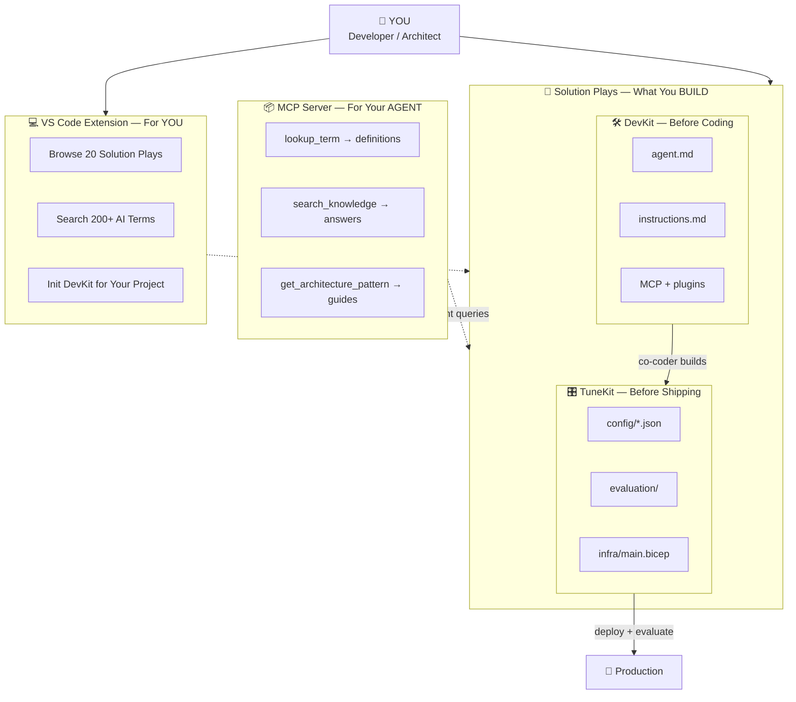
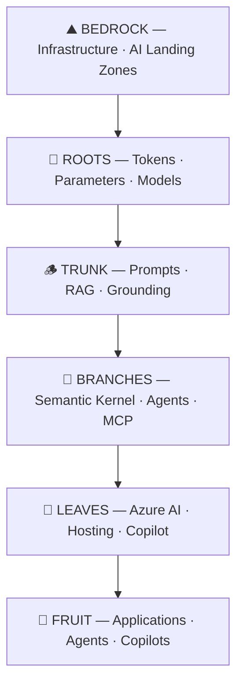

# 🌳 FrootAI — Know the Roots. Ship the Fruit.

> A power kit for infrastructure and platform people to master and bridge the gap with AI applications, agents, and the agentic ecosystem.
> From a single token to a production agent fleet · Infra ⇄ Platform ⇄ Apps

[](https://gitpavleenbali.github.io/frootai/)
[](./mcp-server/)
[](./solution-plays/)
[](./LICENSE)

---

## What is FrootAI?

**FrootAI** = AI **F**oundations · **R**easoning · **O**rchestration · **O**perations · **T**ransformation

| | What | For Whom |
|---|------|----------|
| 🎯 | **Solution Plays** — pre-tuned, deployable AI solutions (RAG, agents, landing zones) | Infra & platform engineers |
| 📖 | **17 knowledge modules** covering AI architecture end-to-end | Cloud Architects, CSAs |
| 🔌 | **MCP Server** — 6 tools, add to any AI agent as a callable skill set | Agent builders, developers |
| 🔗 | **The open glue** — removes silos between infra, platform, and app teams | Everyone |

---

## Quick Start

### Read the docs

```
https://gitpavleenbali.github.io/frootai/
```

### Install the MCP Server (npm)

```bash
# Zero-install — run directly
npx frootai-mcp

# Or install globally
npm install -g frootai-mcp
```

**npm**: [npmjs.com/package/frootai-mcp](https://www.npmjs.com/package/frootai-mcp)

Then add to your MCP config:

```json
{
  "mcpServers": {
    "frootai": { "command": "npx", "args": ["frootai-mcp"] }
  }
}
```

Works with: **Claude Desktop** · **VS Code / GitHub Copilot** · **Cursor** · **Windsurf** · **Azure AI Foundry** · any MCP client

### Install the VS Code Extension

```bash
# From VS Code Marketplace
code --install-extension pavleenbali.frootai
```

Or search **"FrootAI"** in VS Code Extensions (Ctrl+Shift+X).

**Marketplace**: [marketplace.visualstudio.com → pavleenbali.frootai](https://marketplace.visualstudio.com/items?itemName=pavleenbali.frootai)

**What you get:**
- Sidebar with Solution Plays, FROOT Modules, MCP Tools
- Commands: Look Up Term, Search Knowledge, Init DevKit, Architecture Patterns
- Status bar integration

---

## How the Ecosystem Works



| Component | Who Uses It | What It Does |
|-----------|------------|-------------|
| **VS Code Extension** | You (human) | Browse plays, search terms, init DevKit from sidebar |
| **MCP Server (npm)** | Your AI agent | Copilot/Claude calls 6 tools for architecture answers |
| **Solution Play DevKit** | Your co-coder | agent.md + instructions tune the AI for THIS solution |
| **Solution Play TuneKit** | Platform team | Pre-tuned AI configs + evaluation pipeline |
| **Big MCP** (frootai-mcp) | Any agent | "What is temperature?" "How to design RAG?" |
| **Solution MCP** (per play) | Solution agent | "Is my RAG config optimal?" "Validate chunk size" |

---

## The FROOT Framework



| Layer | Modules | What You Learn |
|-------|---------|---------------|
| 🌱 **F — Foundations** | F1, F2, F3 | Tokens, transformers, model selection, 200+ AI terms |
| 🪵 **R — Reasoning** | R1, R2, R3 | Prompts, RAG, grounding, deterministic AI |
| 🌿 **O — Orchestration** | O1, O2, O3 | Semantic Kernel, agents, MCP, tools |
| 🍃 **O — Operations** | O4, O5, O6 | Azure AI Foundry, GPU infra, Copilot ecosystem |
| 🍎 **T — Transformation** | T1, T2, T3 | Fine-tuning, responsible AI, production patterns |

---

## MCP Server — 6 Tools

| Tool | What It Does |
|------|-------------|
| `list_modules` | Browse all 17 modules by FROOT layer |
| `get_module` | Read any module content (F1–T3) |
| `lookup_term` | Look up any of 200+ AI/ML terms |
| `search_knowledge` | Full-text search across all modules |
| `get_architecture_pattern` | 7 pre-built decision guides |
| `get_froot_overview` | Complete FROOT framework summary |

[📖 Full MCP documentation →](./mcp-server/README.md) · [📖 Setup Guide →](https://gitpavleenbali.github.io/frootai/setup-guide)

---

## 🎯 Solution Plays

Pre-tuned, deployable AI solutions — infra + AI config + agent instructions + evaluation.

| # | Solution | What It Deploys | Status |
|---|---------|----------------|--------|
| 01 | [Enterprise RAG Q&A](./solution-plays/01-enterprise-rag/) | AI Search + OpenAI + Container App (pre-tuned) | ✅ Ready |
| 02 | [AI Landing Zone](./solution-plays/02-ai-landing-zone/) | VNet + PE + RBAC + GPU + AI Services | ✅ Ready |
| 03 | [Deterministic Agent](./solution-plays/03-deterministic-agent/) | Reliable agent with temp=0, guardrails, eval | ✅ Ready |
| 04–20 | More coming soon | Call center, IT tickets, multi-agent, and more | 🔜 Coming |

[📖 All Solution Plays →](./solution-plays/)

---

## Repository Structure

```
frootai/
├── docs/                  ← 17 knowledge modules (markdown)
│   ├── README.md           FROOT framework overview
│   ├── GenAI-Foundations.md  F1
│   ├── LLM-Landscape.md     F2
│   ├── ...                   (all 17 modules)
│   └── T3-Production-Patterns.md  T3
├── mcp-server/            ← MCP server (npm-publishable)
│   ├── index.js             Server entry point
│   ├── knowledge.json       Bundled knowledge (664 KB)
│   ├── build-knowledge.js   Bundle generator
│   └── package.json         npm config
├── website/               ← Docusaurus site
│   ├── docusaurus.config.ts
│   ├── sidebars.ts
│   └── src/
├── .github/workflows/     ← CI/CD pipeline
│   └── deploy.yml           Auto-deploy to GitHub Pages
└── .vscode/mcp.json       ← VS Code auto-connects MCP
```

---

## Why FrootAI?

| Problem | FrootAI Solution |
|---------|-----------------|
| Infra teams don't speak AI | 🌱 Foundations layer — tokens, models, glossary |
| RAG pipelines are poorly designed | 🪵 Reasoning layer — RAG architecture, grounding |
| Agent frameworks are confusing | 🌿 Orchestration layer — SK vs Agent Framework comparison |
| AI workloads are expensive | 🍃 Operations layer — cost optimization, hosting patterns |
| AI agents hallucinate in production | 🍎 Transformation layer — determinism, safety, production patterns |
| Teams work in silos | 🔗 FrootAI is the open glue — shared vocabulary across teams |
| Agents burn tokens searching the web | 🔌 MCP server — curated, pre-written, 90% cost reduction |

---

## Contributing

FrootAI is open source. Contributions welcome:

1. **Add content** — improve existing modules or propose new ones
2. **Add MCP tools** — extend the server with new capabilities
3. **Report issues** — found a mistake? Open an issue
4. **Star the repo** — help others discover FrootAI

---

## License

MIT — use it, extend it, embed it, ship it.

---

> **FrootAI** — *The open glue for AI architecture. From root to fruit.*
> Built by [Pavleen Bali](https://linkedin.com/in/pavleenbali)
