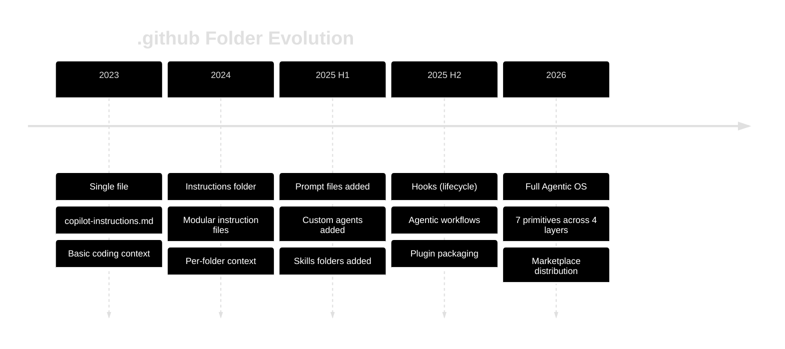
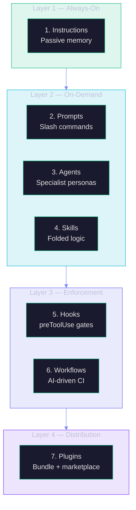
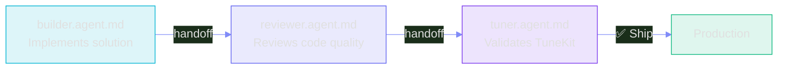

# F4: The .github Agentic OS — GitHub Copilot's 7 Primitives

> **Duration:** 45–60 minutes | **Level:** Deep-Dive
> **Part of:** 🌱 FROOT Foundations Layer
> **Prerequisites:** O2 (AI Agents), O3 (MCP, Tools & Function Calling)
> **Last Updated:** March 2026

---

## Table of Contents

- [F4.1 Why .github Is No Longer Just a Folder](#f41-why-github-is-no-longer-just-a-folder)
- [F4.2 The 4-Layer Architecture](#f42-the-4-layer-architecture)
- [F4.3 Layer 1 — Always-On Context (Instructions)](#f43-layer-1--always-on-context-instructions)
- [F4.4 Layer 2 — On-Demand Capabilities](#f44-layer-2--on-demand-capabilities)
- [F4.5 Layer 3 — Enforcement & Automation](#f45-layer-3--enforcement--automation)
- [F4.6 Layer 4 — Distribution (Plugins)](#f46-layer-4--distribution-plugins)
- [F4.7 FrootAI's Implementation — 19 Files per Solution Play](#f47-frootais-implementation--19-files-per-solution-play)
- [F4.8 Decision Guide — When to Use What](#f48-decision-guide--when-to-use-what)
- [F4.9 Building Your Own .github Agentic OS](#f49-building-your-own-github-agentic-os)
- [Key Takeaways](#key-takeaways)

---

## F4.1 Why .github Is No Longer Just a Folder

GitHub Copilot's `.github` folder has evolved from a single `copilot-instructions.md` file into a **full agentic operating system** — 7 composable primitives across 4 layers that turn any repository into an agent-native workspace.

This is not a future roadmap. This is happening **now**. Every AI-first team needs to understand and adopt these primitives to stay competitive.



### The Mental Model

Think of `.github` as your repository's **operating system for AI agents**:

| Traditional OS | .github Agentic OS |
|---|---|
| Kernel (always running) | **Instructions** (always-on context) |
| Applications (user-launched) | **Prompt Files** (slash commands) |
| Services (background processes) | **Custom Agents** (specialist personas) |
| Libraries (shared code) | **Skills** (self-contained logic) |
| Security policies | **Hooks** (lifecycle enforcement) |
| Cron jobs / systemd | **Agentic Workflows** (AI-driven CI) |
| Package manager | **Plugins** (bundle + distribute) |

---

## F4.2 The 4-Layer Architecture

The 7 primitives are organized into 4 layers, each serving a distinct purpose:



| Layer | Primitives | Trigger | Scope |
|-------|-----------|---------|-------|
| **1. Always-On** | Instructions | Every prompt (automatic) | Passive context |
| **2. On-Demand** | Prompts, Agents, Skills | User or agent invokes | Active capabilities |
| **3. Enforcement** | Hooks, Workflows | Lifecycle events | Guardrails + automation |
| **4. Distribution** | Plugins | Package + publish | Share across repos |

---

## F4.3 Layer 1 — Always-On Context (Instructions)

### Primitive 1: Instructions

**Files:** `.github/copilot-instructions.md` + `.github/instructions/*.instructions.md`

Instructions are **passive memory** — they apply to every prompt automatically without the user asking. Copilot reads these before generating any response.

**Use for:** Coding standards, framework rules, repo conventions, architectural constraints.

### Single File (Legacy)

```markdown
<!-- .github/copilot-instructions.md -->
You are working on an Azure-based RAG pipeline.
Always use Managed Identity. Never hardcode secrets.
Use config/*.json for all AI parameters.
```

### Modular Files (Modern)

```
.github/instructions/
├── azure-coding.instructions.md    # Azure SDK patterns, managed identity
├── rag-patterns.instructions.md    # Chunking, retrieval, anti-hallucination
└── security.instructions.md        # Secrets, PII, access control
```

**Why modular?** Different files apply to different parts of the codebase. Copilot loads only the relevant instructions based on the file being edited, reducing noise and improving accuracy.

### Best Practices

| Do | Don't |
|---|---|
| Keep instructions short and specific | Write essays — agents lose focus |
| Use bullet points and rules | Use vague guidance ("be careful") |
| Reference specific files (`config/openai.json`) | Reference abstract concepts |
| Update when patterns change | Set and forget |

---

## F4.4 Layer 2 — On-Demand Capabilities

### Primitive 2: Prompt Files

**Files:** `.github/prompts/*.prompt.md`

Prompt files are **slash commands** — manually invoked by the user or another agent. They define a specific task with context and steps.

```markdown
<!-- .github/prompts/deploy.prompt.md -->
# Deploy to Azure

## Steps
1. Validate config files exist
2. Run az bicep build to validate template
3. Deploy infrastructure
4. Run smoke test
```

**Invocation:** Type `/deploy` in Copilot Chat → Copilot reads and executes the prompt.

**Use for:** `/security-review`, `/release-notes`, `/changelog`, `/deploy`, `/test`, `/evaluate`

### Primitive 3: Custom Agents

**Files:** `.github/agents/*.agent.md`

Custom agents are **specialist personas** with their own identity, tools, and MCP server bindings. Agents can be **chained via handoffs**:

```
planning agent → implementation agent → review agent
```

```markdown
<!-- .github/agents/builder.agent.md -->
# Builder Agent

You are the implementation agent for this solution.

## Your Tools
- FrootAI MCP Server (frootai-mcp)
- Azure CLI
- Python runtime

## Your MCP Servers
{"servers": {"frootai": {"command": "npx", "args": ["frootai-mcp"]}}}

## Rules
- Use values from config files, never hardcode
- Hand off to reviewer.agent.md when done
```

**Key difference from instructions:** Instructions are passive (always on). Agents are active (invoked for specific tasks) and have their own tool bindings.

### Primitive 4: Skills

**Files:** `.github/skills/<name>/SKILL.md`

Skills are **self-contained folders** with instructions + scripts + references. They're **progressively loaded** — Copilot reads the description first, loads the full instructions only when relevant.

```
.github/skills/
├── deploy-azure/
│   ├── SKILL.md        # Description + prerequisites + references
│   └── deploy.sh       # Executable script
├── evaluate/
│   ├── SKILL.md
│   └── eval.py
└── tune/
    ├── SKILL.md
    └── tune-config.sh
```

**Use for:** Repeatable runbooks, incident triage, IaC risk analysis, deployment procedures.

**Progressive loading:** Copilot reads `SKILL.md` header first. If the user's question matches the skill's domain, Copilot loads the full content. This saves tokens and reduces noise.

---

## F4.5 Layer 3 — Enforcement & Automation

### Primitive 5: Hooks

**Files:** `.github/hooks/*.json`

Hooks are **deterministic shell commands** triggered at **lifecycle events**. They enforce policies before, during, and after tool execution.

**Three lifecycle events:**

| Event | When | Use Case |
|-------|------|----------|
| `preToolUse` | Before a tool executes | Approve or deny tool executions. Policy gates. |
| `postToolUse` | After a tool completes | Audit logging, notifications. |
| `errorOccurred` | When a tool fails | Suggest troubleshooting, auto-recover. |

```json
{
  "hooks": [
    {
      "event": "preToolUse",
      "match": { "toolName": "write_file", "pathPattern": "**/*.env" },
      "action": "deny_if_contains",
      "patterns": ["api_key", "secret", "password"],
      "message": "BLOCKED: Detected secrets. Use Key Vault."
    }
  ]
}
```

**Why hooks are critical:** They make the AI agent **safe by default**. Without hooks, an agent can write secrets to code, modify guardrails, or deploy to production. With hooks, you enforce policies deterministically — no LLM judgment involved.

### Primitive 6: Agentic Workflows

**Files:** `.github/workflows/*.md` (compiled to YAML GitHub Actions)

Agentic workflows are **natural language automation** that compiles to GitHub Actions. They define AI-driven CI/CD pipelines.

```markdown
<!-- .github/workflows/ai-review.md -->
# AI Code Review

## Trigger
On pull request to main branch.

## Steps
1. Validate TuneKit configs
2. Run evaluation pipeline
3. Post review summary as PR comment
4. Block merge if critical issues found
```

**Key insight:** The `.md` file is the **source of truth** — it's human-readable and AI-editable. It compiles to YAML for GitHub Actions.

**Use for:** PR review automation, deployment pipelines, scheduled maintenance, issue triage.

**Permissions:** Always read-only unless explicitly elevated. Principle of least privilege.

---

## F4.6 Layer 4 — Distribution (Plugins)

### Primitive 7: Plugins

Plugins **bundle** agents + skills + commands into a distributable package. Two distribution modes:

| Mode | How | Example |
|------|-----|---------|
| **Self-hosted** | Host on your own repo | Team shares internal agent stacks |
| **Marketplace** | List in GitHub Marketplace | Public distribution, discoverability |

```json
{
  "plugin": "frootai-enterprise-rag",
  "version": "1.0.0",
  "agents": ["builder", "reviewer", "tuner"],
  "skills": ["deploy-azure", "evaluate", "tune"],
  "prompts": ["deploy", "test", "review", "evaluate"],
  "hooks": ["guardrails"],
  "mcp_servers": ["frootai"]
}
```

**plugin.json** declares what's inside. Consumers install the plugin → get all agents, skills, prompts, and hooks preconfigured.

> **FrootAI ships plugin.json in every solution play.** Each of the 20 plays has a full manifest declaring all agentic OS files, DevKit, TuneKit, MCP server bindings, tags, complexity, and status. Browse them at [github.com/gitpavleenbali/frootai/tree/main/solution-plays](https://github.com/gitpavleenbali/frootai/tree/main/solution-plays).

---

## F4.7 FrootAI's Implementation — 19 Files per Solution Play

FrootAI is the **first ecosystem to ship production-ready .github agentic OS folders** for 20 AI solution plays. Here's the complete structure:

```
solution-plays/01-enterprise-rag/
├── .github/
│   ├── copilot-instructions.md          # Layer 1
│   ├── instructions/
│   │   ├── azure-coding.instructions.md  # Coding standards
│   │   ├── rag-patterns.instructions.md  # RAG-specific rules
│   │   └── security.instructions.md      # Security conventions
│   ├── prompts/
│   │   ├── deploy.prompt.md              # /deploy
│   │   ├── test.prompt.md                # /test
│   │   ├── review.prompt.md              # /review
│   │   └── evaluate.prompt.md            # /evaluate
│   ├── agents/
│   │   ├── builder.agent.md              # Implementation
│   │   ├── reviewer.agent.md             # Code review
│   │   └── tuner.agent.md                # TuneKit verification
│   ├── skills/
│   │   ├── deploy-azure/SKILL.md         # Azure deployment
│   │   ├── evaluate/SKILL.md             # Quality evaluation
│   │   └── tune/SKILL.md                 # Config validation
│   ├── hooks/
│   │   └── guardrails.json               # Policy enforcement
│   └── workflows/
│       ├── ai-review.md                  # PR review automation
│       └── ai-deploy.md                  # Deployment automation
```

**19 files × 20 plays = 380 agentic OS files.**

### Agent Chain (per play)



---

## F4.8 Decision Guide — When to Use What

| I want to... | Use this primitive | Layer |
|---|---|---|
| Set coding standards for the whole repo | **Instructions** (`.instructions.md`) | 1 |
| Create a repeatable task (deploy, test) | **Prompt File** (`.prompt.md`) | 2 |
| Create a specialist AI persona | **Custom Agent** (`.agent.md`) | 2 |
| Package a runbook with scripts | **Skill** (`SKILL.md` + scripts) | 2 |
| Block dangerous tool actions | **Hook** (`guardrails.json`) | 3 |
| Automate PR reviews or deployments | **Agentic Workflow** (`.md` → Actions) | 3 |
| Share agent stacks across repos | **Plugin** (`plugin.json`) | 4 |

### Layering Strategy

```
Start here → Layer 1 (Instructions)
↓ Need slash commands? → Layer 2 (Prompts)
↓ Need specialist agents? → Layer 2 (Agents + Skills)
↓ Need safety enforcement? → Layer 3 (Hooks)
↓ Need CI/CD automation? → Layer 3 (Workflows)
↓ Need to share across repos? → Layer 4 (Plugins)
```

---

## F4.9 Building Your Own .github Agentic OS

### Step 1: Start with Instructions (5 minutes)

Create `.github/copilot-instructions.md`:

```markdown
You are working on [PROJECT NAME].
Framework: [e.g., Python FastAPI + Azure]
Always use managed identity. Never hardcode secrets.
Follow the patterns in docs/architecture.md.
```

### Step 2: Add Modular Instructions (10 minutes)

Create `.github/instructions/` with domain-specific files.

### Step 3: Add Prompt Files (15 minutes)

Create `.github/prompts/` for common tasks: deploy, test, review.

### Step 4: Add Agents (20 minutes)

Create `.github/agents/` with specialist personas for your codebase.

### Step 5: Add Skills (20 minutes)

Create `.github/skills/` with self-contained runbooks.

### Step 6: Add Hooks (10 minutes)

Create `.github/hooks/guardrails.json` with `preToolUse` policies.

### Step 7: Add Workflows (15 minutes)

Create `.github/workflows/` with AI-driven CI/CD.

**Total time: ~95 minutes for a complete .github agentic OS.**

Or use FrootAI: run `FrootAI: Initialize DevKit` → get all 19 files instantly.

---

## Key Takeaways

1. **The `.github` folder is now an operating system** — 7 primitives, 4 layers, one repo.
2. **Layer 1 (Instructions)** is the foundation — always start here. Passive memory that applies to every prompt.
3. **Layer 2 (Prompts, Agents, Skills)** adds on-demand power — specialist personas, slash commands, self-contained logic.
4. **Layer 3 (Hooks, Workflows)** adds safety — deterministic enforcement and AI-driven CI/CD.
5. **Layer 4 (Plugins)** enables distribution — share agent stacks across repos and marketplace.
6. **Agent chaining** (builder → reviewer → tuner) creates quality gates that catch issues before production.
7. **Hooks are non-negotiable** — `preToolUse` gates prevent secrets in code, policy violations, and unsafe operations.
8. **FrootAI ships 380 files** — 19 per solution play × 20 plays. Ready-to-use .github agentic OS for 20 AI solutions.

---

> **Next:** [O2: AI Agents & Agent Framework](./AI-Agents-Deep-Dive) for deep agent architecture | [O3: MCP, Tools & Function Calling](./O3-MCP-Tools-Functions) for MCP server patterns
