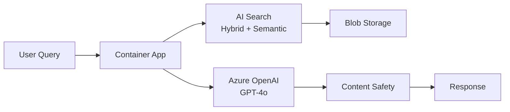

# Solution Play 01: Enterprise RAG Q&A

> **Complexity:** Medium | **Deploy time:** 15 min | **Status:** ✅ Ready
> A production RAG pipeline — Azure AI Search + OpenAI + Container Apps. Pre-tuned. Evaluated.

---

## Architecture



---

## 🛠️ DevKit — Developer Velocity Ecosystem

**For developers who are BUILDING this solution in their IDE.**

Download the DevKit → open folder in VS Code → your co-coder (Copilot/Cursor) becomes RAG-aware.

| File | What It Does |
|------|-------------|
| `agent.md` | Agent personality — citation rules, abstention, 3 few-shot examples |
| `instructions.md` | System prompt + guardrails + output format specification |
| `.github/copilot-instructions.md` | VS Code Copilot context — generates RAG-specific code |
| `.vscode/mcp.json` | Auto-connects FrootAI MCP + solution MCP in workspace |
| `.vscode/settings.json` | IDE optimized for Python + Bicep + AI development |
| `mcp/index.js` | Solution-specific MCP tools (get_rag_config, validate_config) |
| `plugins/` | Reusable search, indexer, evaluator, config loader plugins |

### How to use DevKit

```bash
# 1. Download or clone
git clone https://github.com/gitpavleenbali/frootai.git
cd frootai/solution-plays/01-enterprise-rag

# 2. Open in VS Code
code .

# 3. Your co-coder is now RAG-aware:
#    - Copilot reads agent.md + copilot-instructions.md
#    - MCP auto-connects via .vscode/mcp.json
#    - Ask Copilot: "Build the RAG pipeline following the agent.md rules"
#    - The skeleton is here. The co-coder fills the implementation.
```

---

## 🎛️ TuneKit — AI Fine-Tuning Ecosystem

**For platform teams who are TUNING this solution for production.**

Download the TuneKit → review pre-tuned parameters → adjust knobs → deploy → evaluate.

| File | What It Controls | Pre-Tuned Value |
|------|-----------------|----------------|
| `config/openai.json` | Model + generation | temp=0.1, seed=42, JSON schema, max=1000 |
| `config/search.json` | Retrieval | Hybrid 60/40, top-k=5, threshold=0.78, semantic reranker |
| `config/chunking.json` | Document processing | 512 tokens, semantic, 10% overlap |
| `config/guardrails.json` | Safety | Content safety, PII redaction, injection blocking |
| `infra/main.bicep` | Azure resources | AI Search + OpenAI + Container App + Storage |
| `infra/parameters.json` | Deploy knobs | Region, SKU, model, capacity |
| `evaluation/test-set.jsonl` | Test set | 100 Q&A pairs with ground truth |
| `evaluation/eval.py` | Quality scoring | Faithfulness >0.90, Relevance >0.85, Groundedness >0.95 |

### How to use TuneKit

```bash
# 1. Review and adjust configs
cat config/openai.json    # Check temperature, model, schema
cat config/search.json    # Check retrieval settings

# 2. Deploy infrastructure
az deployment group create --template-file infra/main.bicep --parameters infra/parameters.json

# 3. Run evaluation
python evaluation/eval.py --test-set evaluation/test-set.jsonl

# 4. All green? Ship it.
```

### Tuning Guide

| If You Need... | Adjust This | In This File |
|----------------|-------------|-------------|
| More creative answers | temperature: 0.1 → 0.3 | config/openai.json |
| Cheaper deployment | model: gpt-4o → gpt-4o-mini | config/openai.json |
| More retrieval results | top_k: 5 → 10 | config/search.json |
| Smaller chunks | chunk_size_tokens: 512 → 256 | config/chunking.json |
| Stricter safety | severity_threshold: 2 → 1 | config/guardrails.json |

---

## Quick Deploy (Full Solution)

```bash
# Clone + install
git clone https://github.com/gitpavleenbali/frootai.git
cd frootai/solution-plays/01-enterprise-rag

# Deploy infra
az deployment group create -g myRG --template-file infra/main.bicep --parameters infra/parameters.json

# Upload documents + index
python plugins/indexer.py --source ./your-docs/

# Evaluate
python evaluation/eval.py

# Done. Production RAG pipeline running.
```

---

> **FrootAI Solution Play 01** — DevKit empowers the builder. TuneKit ships it to production.
