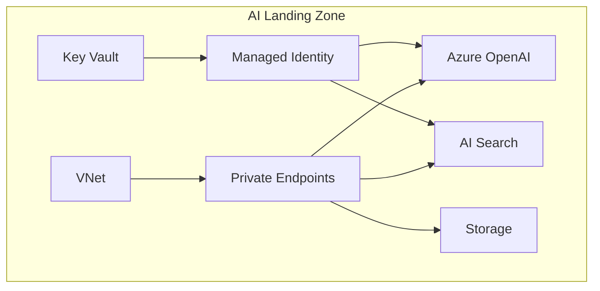

# Solution Play 02: AI Landing Zone

> **Complexity:** Foundation | **Deploy time:** 20 min | **Status:** ✅ Ready
> The bedrock Azure infrastructure for all AI workloads. Deploy this FIRST.

---

## Architecture



---

## 🛠️ DevKit — Developer Velocity Ecosystem

| File | What It Does |
|------|-------------|
| `agent.md` | Infra provisioning assistant — private endpoints, RBAC, WAF |
| `instructions.md` | Deployment checklist + security requirements |
| `.github/copilot-instructions.md` | Copilot generates Bicep following Azure best practices |
| `.vscode/mcp.json` | FrootAI MCP for architecture guidance while coding |
| `mcp/index.js` | Tools: validate_networking, check_rbac, list_resources |
| `plugins/` | Bicep validator, RBAC checker, network tester |

### How to use DevKit
```bash
cd frootai/solution-plays/02-ai-landing-zone
code .  # Copilot is now infra-aware
```

---

## 🎛️ TuneKit — Infrastructure Configuration

| File | What It Controls |
|------|-----------------|
| `config/landing-zone.json` | VNet CIDR, subnets, service SKUs, GPU quota |
| `infra/main.bicep` | All Azure resources (VNet, PE, MI, RBAC, AI services) |
| `infra/parameters.json` | Region, environment name, model, GPU toggle |

### How to use TuneKit
```bash
# Adjust parameters
vi infra/parameters.json

# Deploy
az deployment group create -g myAI-RG --template-file infra/main.bicep --parameters infra/parameters.json
```

---

> **Solution Play 02** — The bedrock. Every AI solution grows from here.
