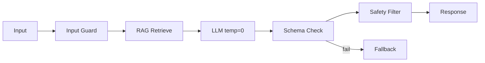

# Solution Play 03: Deterministic Agent

> **Complexity:** Medium | **Deploy time:** 10 min | **Status:** ✅ Ready
> A reliable agent that doesn't hallucinate. temp=0, structured JSON, multi-layer guardrails.

---

## Architecture

---

## 🛠️ DevKit — Developer Velocity Ecosystem

| File | What It Does |
|------|-------------|
| `agent.md` | Deterministic personality — anti-sycophancy, abstention, citation rules |
| `instructions.md` | System prompt with verification chain + structured output spec |
| `.github/copilot-instructions.md` | Copilot generates guardrail pipeline code |
| `.vscode/mcp.json` | FrootAI MCP + agent validation tools |
| `mcp/index.js` | Tools: validate_response, check_determinism, test_abstention |
| `plugins/` | Guardrail chain, schema validator, citation checker, confidence scorer |

---

## 🎛️ TuneKit — AI Fine-Tuning Ecosystem

| File | Pre-Tuned Value |
|------|----------------|
| `config/openai.json` | temp=0, seed=42, strict JSON schema, max=500 |
| `config/guardrails.json` | Content safety, injection blocking, confidence ≥0.7, anti-sycophancy |
| `infra/main.bicep` | Container App + OpenAI + Content Safety |
| `evaluation/test-set.jsonl` | In-scope, out-of-scope, and correction test cases |
| `evaluation/eval.py` | Consistency >95%, Faithfulness >0.90, Groundedness >0.95, Safety 0 failures |

---

> **Solution Play 03** — When AI must not fail.
