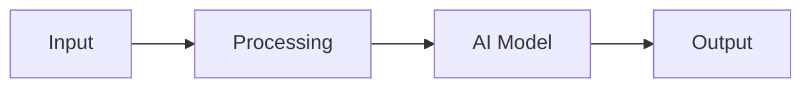

# Solution Play 09: AI-Powered Search Portal

> **Complexity:** Medium | **Status:** Skeleton
> Enterprise search with hybrid + semantic ranking  AI Search + Web App + OpenAI.

---

## Architecture

---

## DevKit

Download the DevKit to empower your co-coder for this solution.

| File | Purpose |
|------|---------|
| agent.md | Agent personality + rules |
| instructions.md | System prompts + guardrails |
| .github/copilot-instructions.md | IDE coding context |
| .vscode/mcp.json | MCP auto-connect |
| mcp/index.js | Solution-specific tools |
| plugins/ | Reusable functions |

---

## TuneKit

Download the TuneKit to fine-tune AI for production.

| Config | What It Controls |
|--------|-----------------|
| config/openai.json | Model + generation parameters |
| config/guardrails.json | Safety + business rules |
| infra/main.bicep | Azure resources |
| evaluation/ | Test set + scoring |

Infra: AI Search  App Service  Azure OpenAI  Blob Storage
Tuning: Hybrid weights, semantic config, scoring profiles, filters

---

> **FrootAI Solution Play 09**  DevKit builds it. TuneKit ships it.
